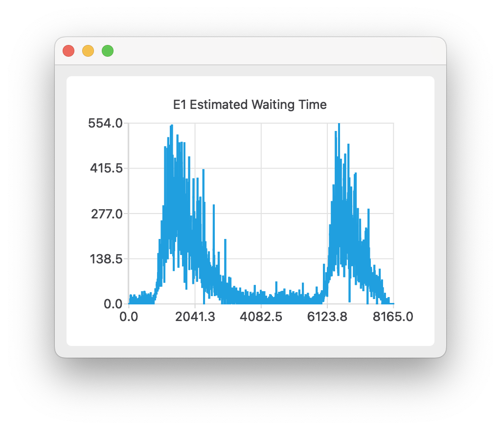

# 第五次上机设计说明

下面说明我根据第五次上机作业的要求完成的设计。

## 上机内容

电梯高峰期预警和推荐功能

- 根据对电梯仿真运行的统计分析结果，推测电梯运行的高峰期，给在此阶段内有乘梯需求的乘客提前预警或推荐电梯较为空闲的时间段。
- 提示：在随机产生乘容所去的楼层时，加上时间因素，在不同时刻随机产生的乘客数量及目的地楼层体现出较大差别，这样比较容易做出预测。
- 高峰期预警和推荐功能，两个选择一个实现即可。

### 程序设计

这次上机我选择实现高峰期预警功能。

预警的原理是：将仿真运行的时间分为若干时段，统计每个时段内乘客的等待时间，并取其均值。在预警时，判断当前时段以及邻近的两个时段内是否有乘客平均等待时间超过一定值的时段。如果有，则发出提示，意为当前时段可能处于高峰期。

首先，我在用于统计数据的 `statistics` 类里增加了一个用于统计各电梯、各时段乘客等待时间的成员：

```cpp
    std::vector<std::map<long long, std::pair<long long, long long>>> estimated_waiting_time;  // elevator:time:data
```

> 该成员记录了电梯序号、时间段信息以及乘客的等待时间数据

记录统计数据：

```cpp
void statistics::add_passenger_waiting_time(int elevator, std::pair<long long, long long> time) {
    // 其余内容省略
auto ratio = 1000 / time_unit;  // 加速比，用于支持程序在加速运行的情况下获取正确的统计数据
    auto time_division = (start_time - base_timestamp) * ratio / sampling_interval_millisecond * sampling_interval_millisecond;  // 计算该条数据所属的时段
    estimated_waiting_time[elevator][time_division].first += time_gap * ratio;  // 总乘客等待时间
    ++estimated_waiting_time[elevator][time_division].second;  // 总数据量
}
```

获取统计数据：

```cpp
std::map<long long, long long> statistics::get_estimated_waiting_time(int elevator) {
    if (elevator < 0 || elevator >= elevator_statistics.size()) {
        throw std::range_error("in statistics.cpp: parameter \"elevator\" out of range: " + std::to_string(elevator));
    }
    std::map<long long, long long> ret;
    for (auto i: estimated_waiting_time[elevator]) {
        auto time_division = i.first;  // 该条数据所属的时段
        auto total = i.second.first;  // 该时段内的总乘客等待时间
        auto count = i.second.second;  // 该时间段内的数据量
        ret[time_division] = total / count;  // 总时间除以数据量，得到平均等待时间
    }
    return ret;
}
```

当一次仿真完成后，程序会将 `estimated_waiting_time` 中的数据写入文件，以便下次运行时读取。

另外，为了使乘客请求电梯的行为具有一定的规律，我为程序指定了两个不同的乘客刷新率（不同的泊松分布 $\lambda$ 值），以及指定了两个乘客刷新的高峰时段。在一般时段内，程序使用较低的刷新率产生乘客，而到高峰期时，则使用较高的刷新率产生乘客，以此来模拟早、晚高峰的场景。

```json
{
  // 指定正常刷新率、高峰期刷新率
  "simulator.passengerSpawnRate": [0.05, 0.8],
  // 指定高峰期的开始时间和结束时间。这里指定了两个高峰期
  "simulator.rushHours": [
    [800, 1300],
    [6000, 6500]
  ]
}
```

为了显示统计结果，我为程序增加了一个显示电梯各时段内平均等待时间的图表。

重复运行程序若干次后，统计得到的乘客平均等待时间会出现一定的规律，高峰期预警的准确度也会相应地提高。

## 运行结果


> 注：这里我为了方便演示，加速了程序的运行速度。
>
> 当程序根据历史数据认为该电梯可能处于高峰期时，将可达楼层的背景设为红色。

可以查看每个电梯的预测数据：


