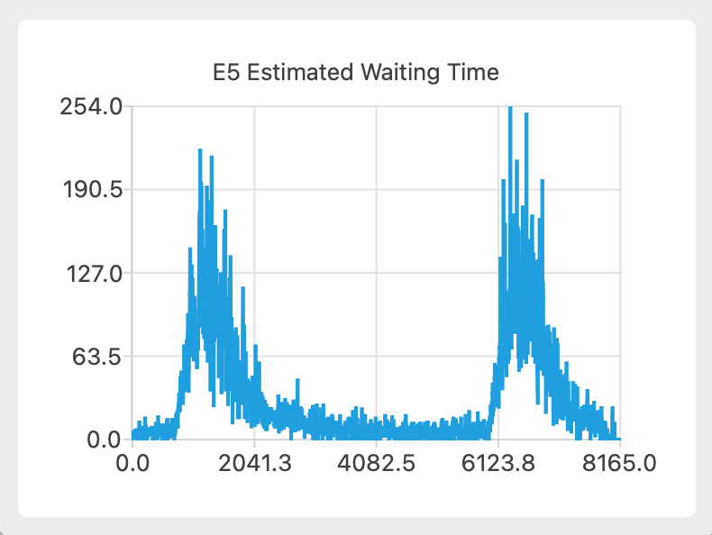

# ObjectOrientedProgramming

面向对象程序设计课程实验

## 题目

课程实验分为 5 次上机，首先有一个基本题目，然后每次上机都会在基本题目的基础上增加新的要求，要求学生在上一次实验的基础上修改程序，完成新的要求。

**基础题目**

{width=300 height=200}

<details>
<summary>上机细节</summary>

**第一次上机**

{width=300 height=200}

[第一次上机报告](.assets/1st/design-description.md)

**第二次上机**

{width=300 height=200}

[第二次上机报告](.assets/2nd/design-description.md)

**第三次上机**

{width=300 height=200}

[第三次上机报告](.assets/3rd/design-description.md)

**第四次上机**

{width=300 height=200}

[第四次上机报告](.assets/4th/design-description.md)

**第五次上机**

{width=300 height=200}

[第五次上机报告](.assets/5th/design-description.md)
</details>

**最终效果**

{width=300 height=200}

{width=300 height=200}

{width=300 height=200}

## Prerequisites

macOS:

```sh
brew install qt@6 nlohmann-json
```

Ubuntu:

```sh
sudo apt install qt6-base-dev nlohmann-json3-dev
```

Windows:

1. 下载并安装 [MSYS2](https://www.msys2.org/#installation)

2. 在 MSYS2 UCRT64 环境下安装项目依赖：

   ```sh
   pacman -S mingw-w64-ucrt-x86_64-toolchain mingw-w64-ucrt-x86_64-cmake mingw-w64-ucrt-x86_64-qt6-base mingw-w64-ucrt-x86_64-qt6-charts mingw-w64-ucrt-x86_64-nlohmann-json
   ```

## Build & Run

1. 构建：

   ```sh
   mkdir build && cd build
   cmake ..
   cmake --build . -- -j$(nproc)
   ```

2. 运行

   ```sh
   ./ObjectOrientedProgramming
   ```

## Package

构建完成后，在 `build` 目录下执行：

```sh
cpack
```