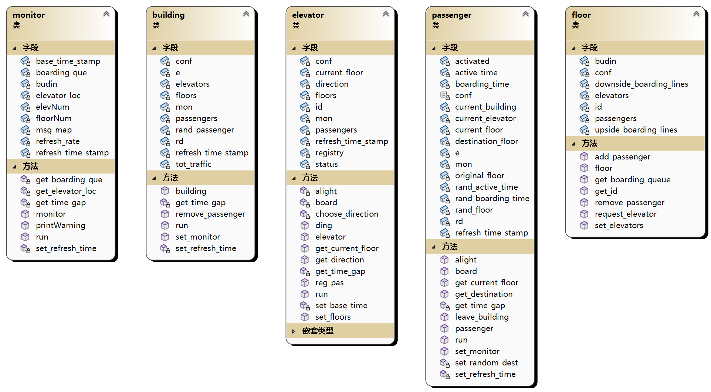

# 第一次上机设计说明

本次上机我设计了五个类：building, elevator, floor, passenger, monitor。下面将对这五个类分别进行说明。



## building

building 类代表整栋大楼，负责管理所有 elevator, floor 和 passenger 对象，并且负责随机生成 passenger 对象。building 类实例化时会读取配置文件 `config.json`，其中存储了所有仿真程序所需的参数。可以修改配置文件的内容来更改仿真程序的行为。`config.json` 的内容如下：

```json
{
  "elevator.count": 10,  // 电梯数
  "elevator.capacity": 15,  // 电梯最大载客量
  "elevator.initialFloor": 1,  // 电梯初始楼层
  "elevator.speed": 1,  // 电梯移动速度，n 秒每层
  "building.floors": 40,  // 楼层数
  "passenger.boardingTimeRange": [1, 3],  // 乘客登梯耗时，服从均匀分布
  "passenger.activeTimeRange": [0, 10],  // 乘客想要请求电梯的时间，服从均匀分布
  "simulator.simulatedTime": 10,  // 仿真程序运行时间，单位为分钟
  "simulator.traffic": 1000,  // 仿真程序最大人流量
  "simulator.refreshRateMillisecond": 300,  // 终端界面刷新时间，单位为毫秒
  "simulator.passengerSpawnRate": 0.5  // 乘客刷新率，实际上是泊松分布的 lambda 值
}
```

JSON 对象的读取通过引入第三方库实现。在读取完配置文件后，building 类会将读取到的 JSON 对象存储到自己的 `conf` 属性中，然后根据其中的参数实例化相应数量的 elevator 和 floor 对象，并将 `conf` 通过 elevator 和 floor 的构造函数传递给它们。

building 类将创建出来的 elevator 和 floor 对象存储起来，然后分别调用每个 elevator 对象的 `set_floors()` 方法来设置每个电梯可以到达的楼层 (目前是每个电梯所有楼层都可达)，以及调用每个 floor 的 `set_elevators` 方法来设置每个楼层可以调用的电梯。

同时，building 类在实例化时还会获取一个时间戳，用于在一段时间后生成 passenger 对象。

building 类的实例化完成之后，程序通过在 `main()` 函数的循环中不断调用 building 对象的 `run()` 方法，来实现对 building 对象的刷新。

在 `run()` 方法中，building 对象会判断当前时间距上次刷新时间的间隔，如果间隔超过 1 秒，那么 building 对象会根据 `conf` 中给出的 $\lambda$ 值生成 $X$ 个 passenger 对象，其中 $X$ 服从参数为 $\lambda$ 的泊松分布。

同时，building 对象还会调用其管理的每个 elevator 和 passenger 对象的 `run()` 方法，以实现这些对象的刷新。

## elevator

elevator 类代表大楼里的电梯。每个 elevator 对象都有自己的 `current_floor`, `passengers`, `registry` 属性，其中 `current_floor` 表示电梯当前所处的楼层，`passengers` 表示电梯内的乘客，`registry` 用于记录乘客的乘梯、下梯请求。elevator 类有一个 `ding()` 方法（名字来源于现实里电梯到达一层后会发出 "ding～" 的一声），该方法完成电梯到达一层后完成的乘客下梯、乘客乘梯、电梯状态转换等操作。

elevator 类也有一个 `run()` 方法，该方法通过查询当前时间来控制电梯的移动，以及调用 `ding()` 方法来完成到达新的一层后可能产生的乘客上下梯操作。building 类的 `run()` 方法会调用该 `run()` 方法，因此 building 对象会和 elevator 对象同步刷新。

## floor

floor 类代表大楼的楼层。每一层楼都是一个 floor 对象。该对象用于保存该楼层的乘客，以及该楼层可以调用的电梯。当乘客需要乘梯时，乘客会调用其所在楼层的 `request_elevator()` 方法，该方法会为乘客选择一个可用的电梯，并将乘客的登梯请求传递给对应的 elevator 对象。同时 `request_elevator()` 方法会将乘客加入到一个乘梯队列，当电梯到达时，电梯会获得这个乘梯队列，并按照队列的顺序让乘客乘梯。

## passenger

passenger 类代表大楼中的乘客。每个 passenger 对象被生成时，以及乘客下梯之后，都会产生一个随机的激活时间 `active_time`。当激活时间到时后，乘客会产生一个乘梯请求，并通过调用其存储的 `current_floor` 对象的 `request_elevator()` 方法来发送乘梯请求。

passenger 类有一个 `run()` 方法，该方法会获取当前时间，并判断是否激活乘客。当乘客被激活后，就会发出乘梯请求，等候电梯，乘梯，到达目标楼层，然后进入未激活状态。

building 类的 `run()` 方法会调用该 `run()` 方法，因此 building 对象会和 passenger 对象同步刷新。

## monitor

monitor 类用于监控大楼的运行情况。monitor 类有一个 `run()` 方法，该方法会在每个时间片结束后，统计大楼中的乘客、电梯、楼层的状态，并将这些状态输出到屏幕上。可以通过配置文件更改时间片的长度。

附：程序运行结果


> 每个电梯井的左边是电梯的运行状态，右边是电梯的乘梯队列。乘梯队列由两个数字组成：第一个数字代表乘坐上行方向电梯的乘客数量，第二个数字代表乘坐下行方向电梯的乘客数量。